

  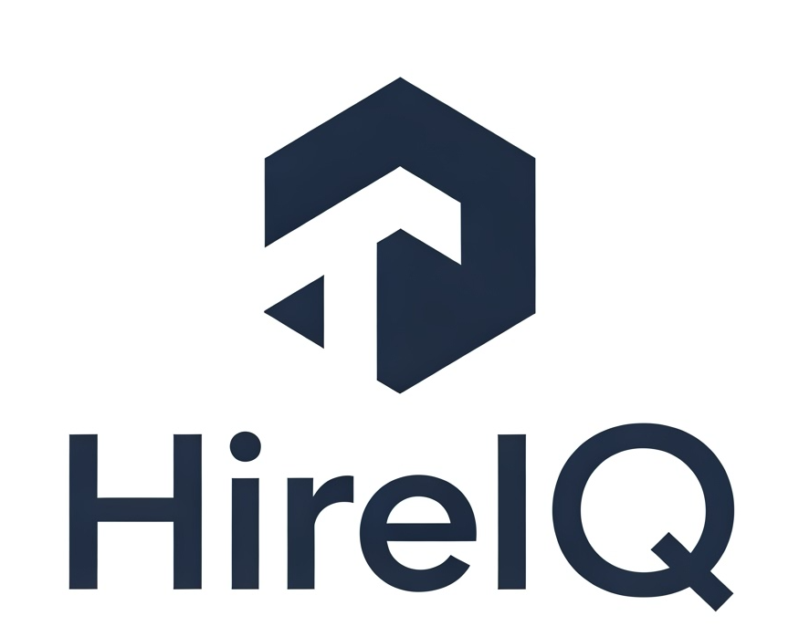

# HireIQ 
> AI-Powered Interview Matching and Scheduling Solution
## 🧭 **Table of Contents**

* 📖 **Overview**
    * 💡 [Our Understanding of the Problem](#-our-understanding-of-the-problem)
* 🚀 **Event Storming**
    * 📜 [Event Storming](#-event-storming)
* ✅ **NFR and Assumptions**
  * ⚡ [Non-Functional Requirements](#-non-functional-requirements)
  * 🚧 [Assumptions & Constraints](#-assumptions--constraints)
* 🏗️ **Architecture & Design**
    * ✨ [Architectural Characteristics](#-architectural-characteristics)
    * 🗺 [Architectural Style](#-architectural-style)
    * 🏢 [C4 Architecture](#-c4-architecture)
    * 🌐 [System Context Diagram](#-system-context-diagram)
    * 📦 [Container Diagrams](#-container-diagrams)
    * 🧩 [Component Diagrams](#-component-diagrams)
    * 📘 [C4 Diagram Legend](#-c4-diagram-legend)
* 📝 **Architecture Decision Records**
    * 📜 [ADRs](#-architecture-decision-records)
* 🧑‍🔬 **Testing & Evaluation Strategy**
    * 🧪 [Testing & Evaluation Strategy](#-testing--evaluation-strategy)
* 💻 **Tech Stack**
    * 🛠️ [Tech Stack](#-tech-stack)
* 📦 **Deployment**
    * 🚀 [Deployment](#-deployment)
* 👥 **Team Members**
    * 👥 [Team Members](#-team-members)

## 📖 Overview

### 💡 Our Understanding of the Problem

**The Challenge**

The core problem is the significant inefficiency and complexity faced by MindCompute recruiters in scheduling technical interviews. The current process is manual, fragmented, and lacks the necessary integration and automation. This results in several key issues:

* **Inefficient Interviewer Identification:** Recruiters struggle to find the right interviewers with the necessary skills and availability.
* **Scheduling Conflicts and Manual Coordination:** The back-and-forth coordination between interviewers and interviewees leads to frequent errors and delays.
* **Lack of Integration and Data Visibility:** The absence of streamlined integration with existing systems hinders the flow of information and makes it difficult to track the interview process.
* **Lack of Automated Communication:** Manual communication introduces delays and the potential for miscommunication.
* **Difficult Reporting and Performance Tracking:** The inability to easily generate reports makes it hard to identify bottlenecks and improve the process.

**Our Proposal**

* These issues result in a time-consuming, error-prone, and frustrating experience for both recruiters and interviewees, ultimately impacting the efficiency of the hiring process.
* To address these issues and streamline the interview scheduling process, we propose an AI-powered interview scheduling solution that leverages automation, AI agents, and integration with existing systems. 
* The sections to follow capture the event storming, architecture, and design decisions made to build this solution.
  
## 🚀 Event Storming

We employed Event Storming, a collaborative technique from Domain-Driven Design (DDD), to discover domain requirements and model the system. Our process followed a structured approach: first identifying key domain events, then mapping commands, actors, and their relationships. Through multiple iterations, we derived the major business flows by analyzing the interactions between commands, aggregates, and events.

**What is Event Storming?** A collaborative workshop format for domain exploration that brings together domain experts and technical team members to create a shared understanding of business processes.

**Benefits:**
- Creates a common language between technical and business stakeholders
- Provides a visual representation of complex business processes
- Helps identify bounded contexts and aggregate roots for domain-driven design
- Enables quick exploration of business processes without technical details
- Surfaces inconsistencies and gaps in understanding early

### Event Storming Legend
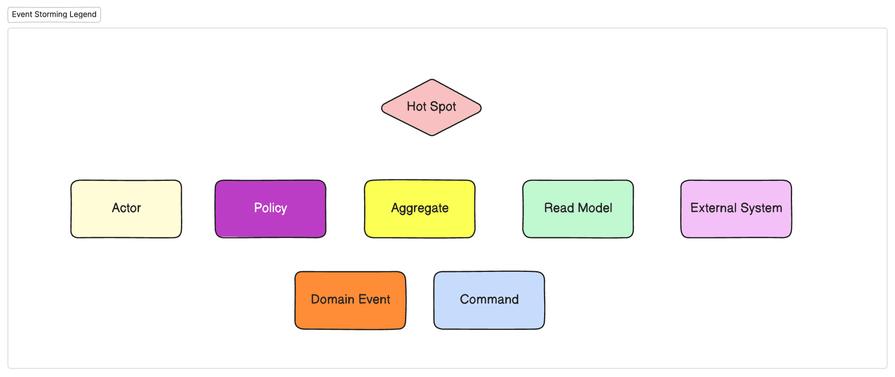

Event Storming uses a standardized set of colored sticky notes to represent different elements of the business domain:
- **Orange**: Domain Events - Something that happened in the system
- **Blue**: Commands - Actions that trigger domain events
- **Yellow**: Actors - Users or systems that issue commands
- **Purple**: Policies - Business rules that react to events
- **Pink**: Aggregates - Clusters of related commands and events
### Event Identification
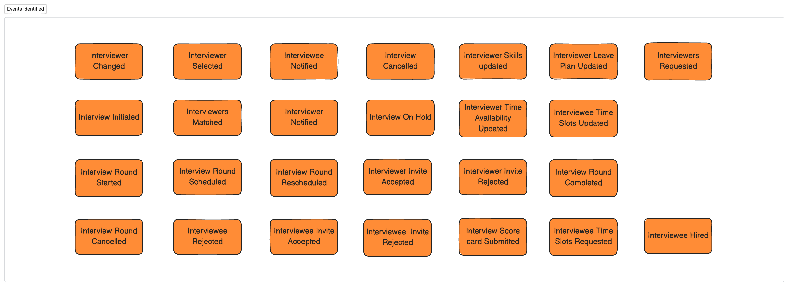
### Command, Event and Actor Identification
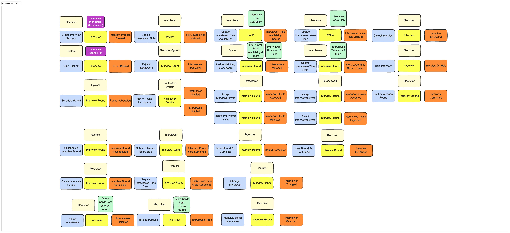
### Business Flows
After event storming, we identified five key business flows that represent the core processes of our system. Each flow consists of commands (actions), events (outcomes), and policies (business rules) that govern the process.
#### 1. Starting Interview
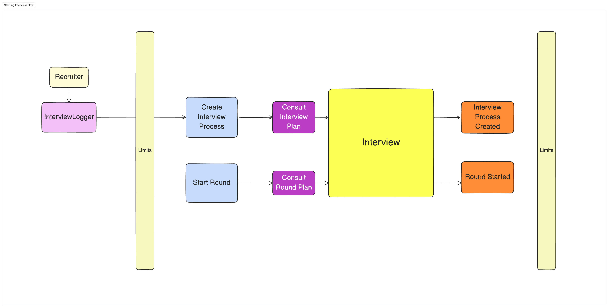

#### 2. Interviewer Matching
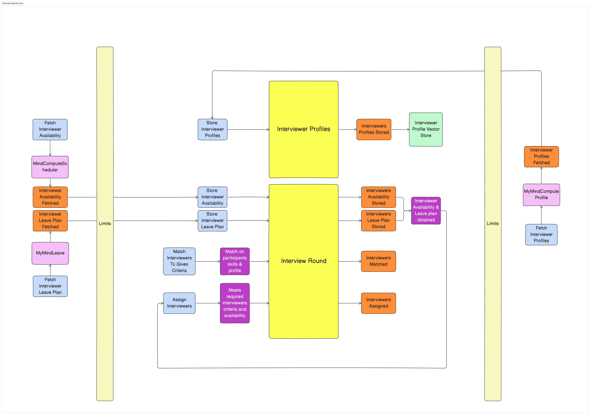

#### 3. Interview Scheduling
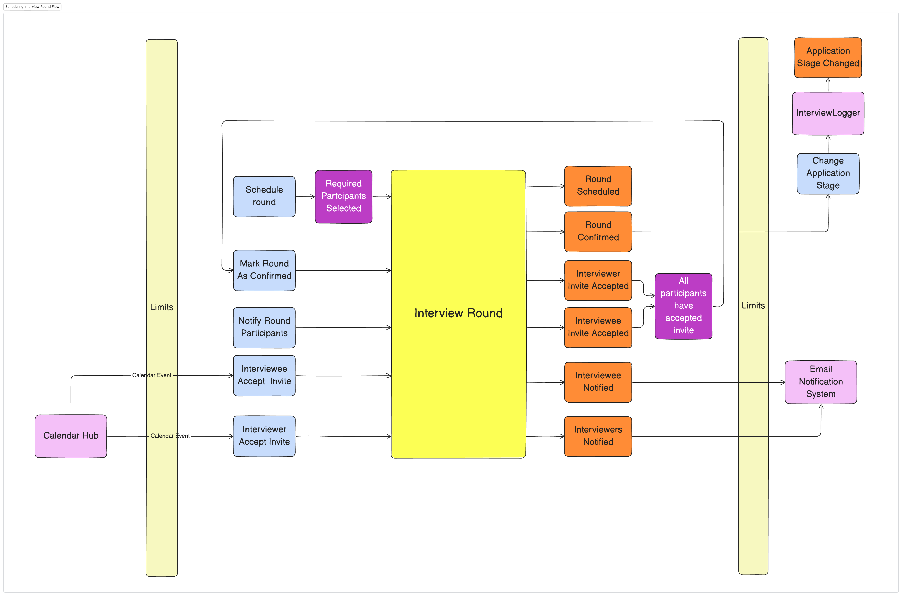

#### 4. Interview Rescheduling
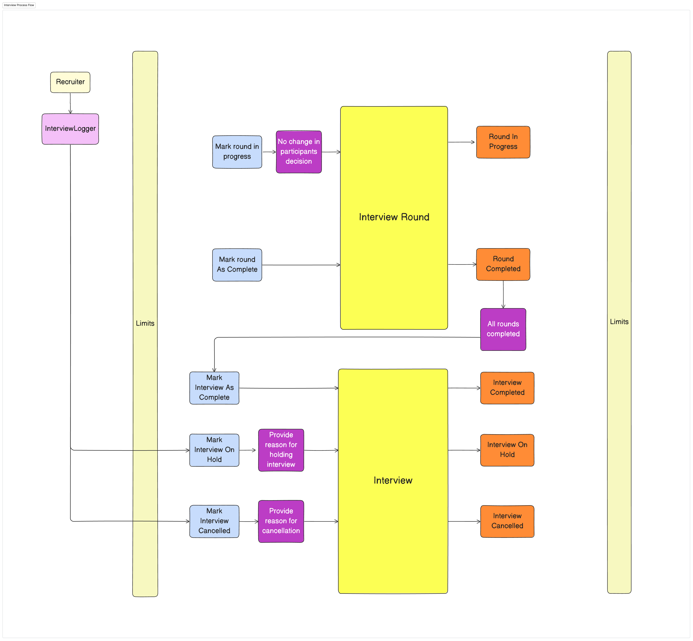

#### 5. Interview Process
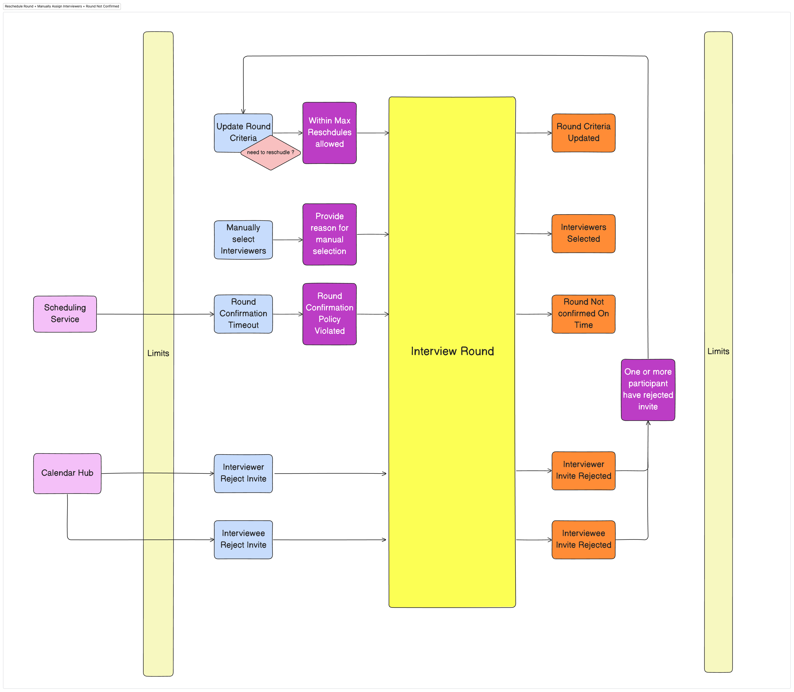

#### Conclusion
Through the event storming exercise, we discovered the domain and requirements for our solution. We identified two key aggregates that define our bounded contexts and transactional boundaries:

1. **Interview** - Manages the overall interview process for an interviewee
2. **Interview Round** - Handles individual interview sessions within the process

The event storming process helped us develop a ubiquitous language - a common vocabulary shared by all team members and stakeholders that eliminates translation between business and technical terminology.

For a more detailed report on the different iterations, business flows, and the complete event storming analysis, see [our detailed event storming documentation for HireIQ](event-storming/event-storming.md).

## ✅ NFR and Assumptions

### ⚡ Non Functional Requirements

* Responsiveness - The system should provide a responsive user experience for recruiters and candidates during profile 
matching and scheduling interactions. Any delays introduced by AI/LLM components should be gracefully handled with 
fallback messaging or loading states.
* Scalability - The platform must be able to scale horizontally to handle increases in usage during hiring spikes. Key services like embedding processing, match-making, and scheduling should support autoscaling.
* Fault Tolerance & Graceful Degradation - Failures in external dependencies (e.g., Calendar Hub, InterviewLogger, LLM API) 
should not break core workflows. The system should degrade gracefully, offering partial functionality or fallback flows.
* Auditability & Traceability - AI-generated decisions (e.g., interviewer matching) should be traceable with supporting 
metadata and reasoning. System actions (e.g., schedule created, invite rejected) must be logged and auditable.
* Security & Data Privacy - Sensitive information like candidate data, interview feedback, and calendar events must be 
securely stored and accessed. The system must support role-based access, data encryption, and comply with GDPR-aligned 
practices.

### 🚧 Assumptions & Constraints
* Assumptions
  * InterviewLogger Integration
    - InterviewLogger will trigger webhooks to the Interview Scheduling System when:
      - A new interviewee is shortlisted.
      - An interviewee advances to the next interview round.
    - Payload will include following information. This data will be collected offline and made available through the webhook.
      - Interviewee slot preferences
      - Preferred tech stack
      - Other interview-related information
  * MyMindComputeProfile Integration
    - MyMindComputeProfile Events/APIs will be leveraged/built for bulk and incremental load of the profile information carrying skill set and required details to vector database.
  * Communication & Scheduling
    - Email will be the primary communication method for both interviewers and interviewees.
    - Slot preferences, interview capacity and availability will be managed via MindComputeScheduler or an equivalent scheduling tool.
  * All interview invites will be sent from a generic system-owned email ID (e.g., recruitment-tw-noreply@gmail.com).
    This email ID will be used to create and manage calendar events, and will have Calendar Hub webhooks configured to
    listen for acceptance or rejection responses from both interviewees and interviewers.
  * OpenTelemetry (otel) agent will be attached to all deployed services to enable standardized metrics, traces, and logs collection.
    This ensures the system is observable and supports effective monitoring, debugging, and performance analysis across environments.
* Constraints:
  * Limited control over external LLMs in terms of latency, downtime. Need explicit handling of rate limits and cost constraints
  * Automatic matching limitation during external system failures - If external systems like Calendar Hub,
    InterviewLogger, or Leave Management System are unavailable, the platform may not be able to perform automatic match-making or scheduling.
    In such cases, fallback mechanisms (like manual intervention) will need to be taken by recruiters.
  * Limited explain-ability in AI-driven scheduling - Since match-making and scheduling decisions are influenced by AI agents
    (e.g., LLMs and vector-based retrieval), the reasoning behind certain decisions may not always be fully explainable in
    traditional rule-based terms.

## 🏗️ Architecture & Design

### ✨ Architectural Characteristics
[ADR 5: Architectural Characteristics](adrs/0005-architectural-characteristics.md)

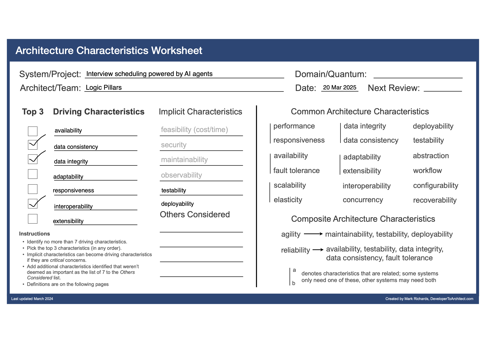

### 🗺 Architectural Style

#### Key Architectural Styles

## Architectural Foundation: Event-Driven Intelligence

At the heart of HireIQ lies an **event-driven architecture**, designed to orchestrate intelligent automation. The **Event Bus** acts as the communication backbone, capturing events and triggering actions across the system. This real-time communication hub allows us to decouple our services, making them more resilient and scalable.

* **Event-Driven Architecture:**
  * The **Event Bus** captures events from sources like InterviewLogger, triggering asynchronous actions across the system.
  * This enables scalability, fault tolerance, and real-time responsiveness.
  * **Event Sourcing** ensures that all changes to the system state are captured as a sequence of events, providing a reliable source for insights and auditing.

* **AI-Powered Automation:**
  * **LangFlow**, a powerful workflow engine, orchestrates AI agents to automate complex scheduling tasks.
  * Leveraging a **configurable LLM** and the **Profile Vector Database**, LangFlow intelligently matches candidates with suitable interviewers, considering skills, availability, and semantic relevance.
  * This AI-powered matching significantly reduces manual effort and improves matching accuracy.

* **Microservices Architecture:**
  * To achieve modularity and independent scalability, particularly for our AI-driven matching capabilities, we've decomposed the system into microservices.
  * This approach enhances maintainability and allows for targeted scaling.

* **API Layer:**
  * APIs serve as an adapter layer, facilitating communication between microservices and external systems.
  * This ensures loose coupling and enables seamless integration.

## Summary

By prioritizing an event-driven architecture and integrating AI-powered automation, we've created a solution that streamlines the interview scheduling process, reduces scheduling time, and improves interviewer matching accuracy. This architecture provides a modern and efficient solution.

### 🏢 C4 Architecture

A high-level overview of the system architecture using the C4 model.

### 🌐 System Context Diagram

The system context diagram provides a high-level view of how the HireIQ matching and scheduling system interacts with 
external systems, users, and its surrounding ecosystem.

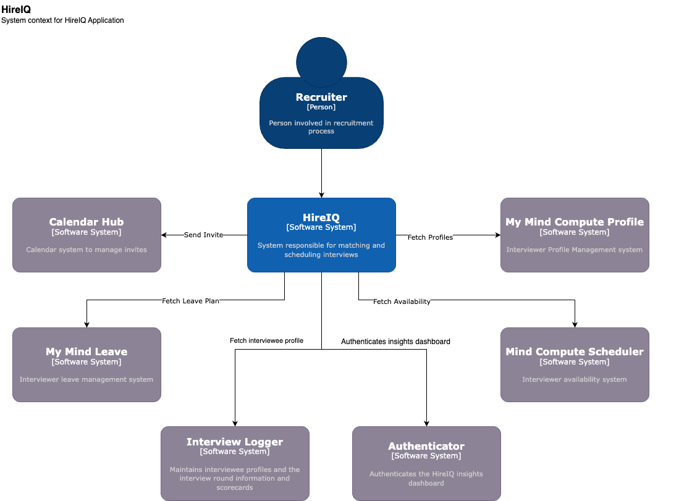

### 📦 Container Diagrams

This container architecture outlines the HireIQ matching and scheduling system, breaking down key systems like 
interview management, LangFlow-based AI orchestration, embedding pipelines, and observability.
It shows how external systems like InterviewLogger, Calendar Hub, and LLM providers integrate with internal services to 
automate match-making and scheduling workflows.

[📦 View Container Architecture Summary](architecture/pages/c4-container.md)

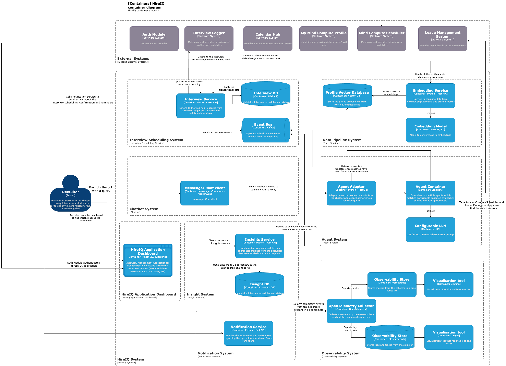

### 🧩 Component Diagrams

This component-level breakdown captures how the HireIQ matching and scheduling system automates interview scheduling and 
profile matching using LangFlow, vector embeddings, external calendar integrations, and LLM-powered assistants. 
The diagrams detail internal flows across scheduling, profile search, embedding pipelines, event-driven invites, and 
recruiter insights.

[📦 View Component Architecture Summary](architecture/pages/c4-component.md)

#### 1. **Interview Service - Scheduling Components**

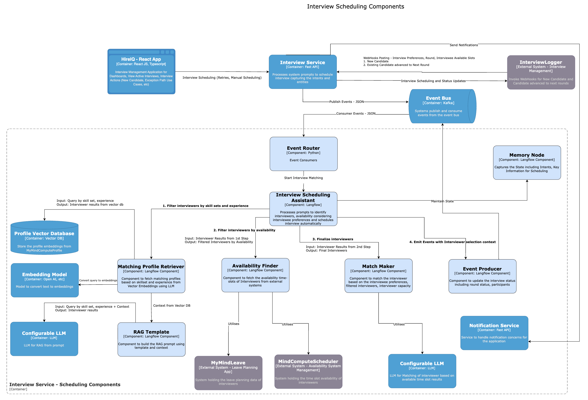

#### 2. **Profile Search & Assistant Langflow Agent**

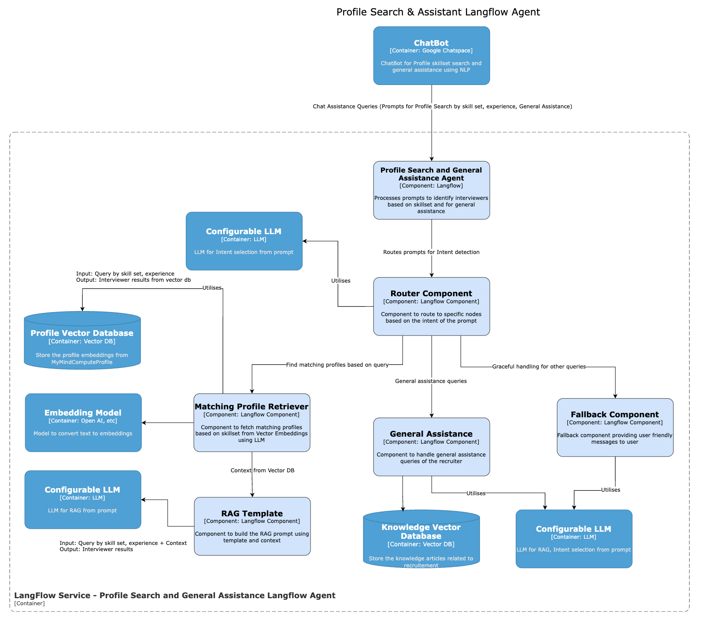

#### 3. **DataPipeline for Vector DB**

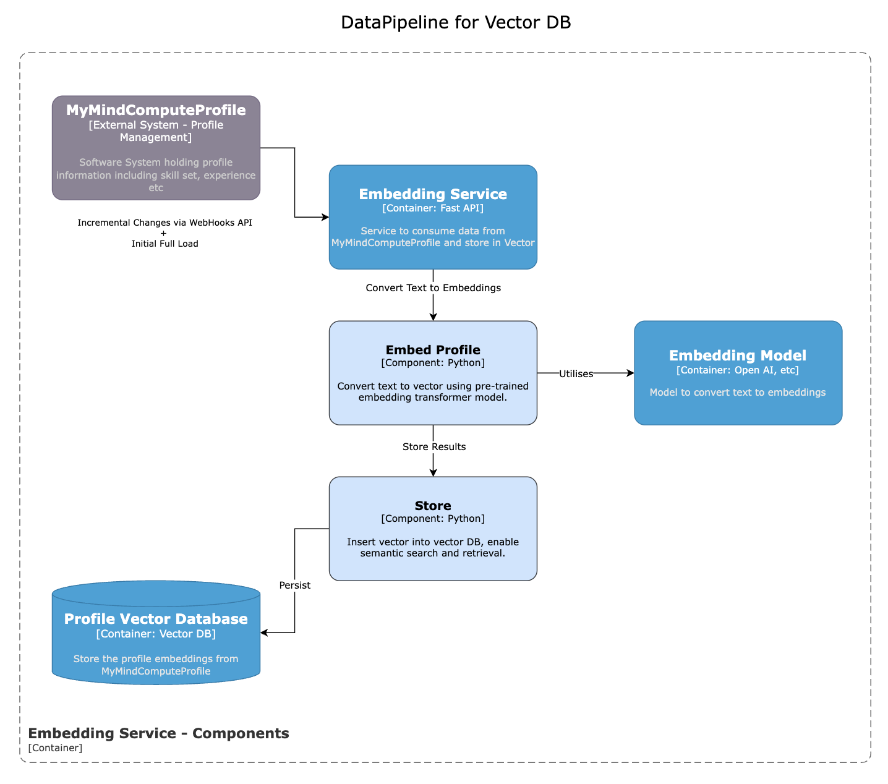

#### 4. **Interview Service - Interview Invites Handling**

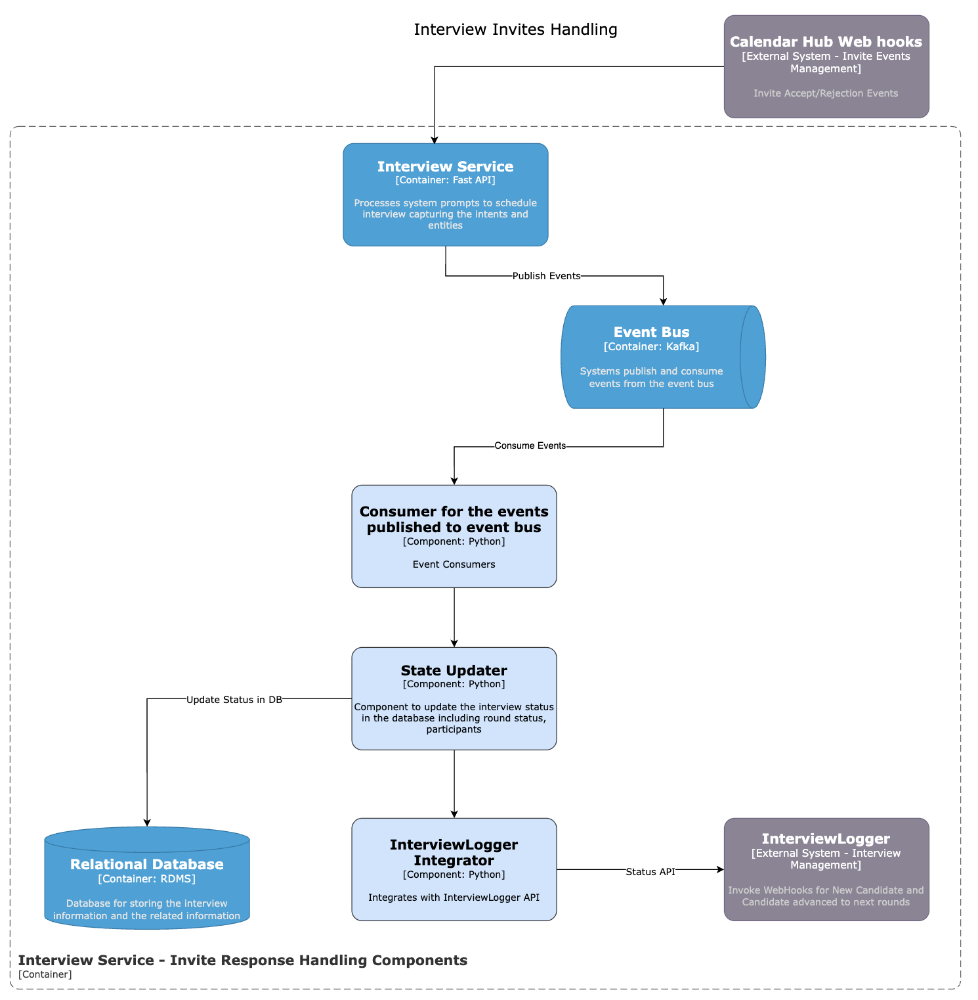

#### 5. **Insights for Recruiters**

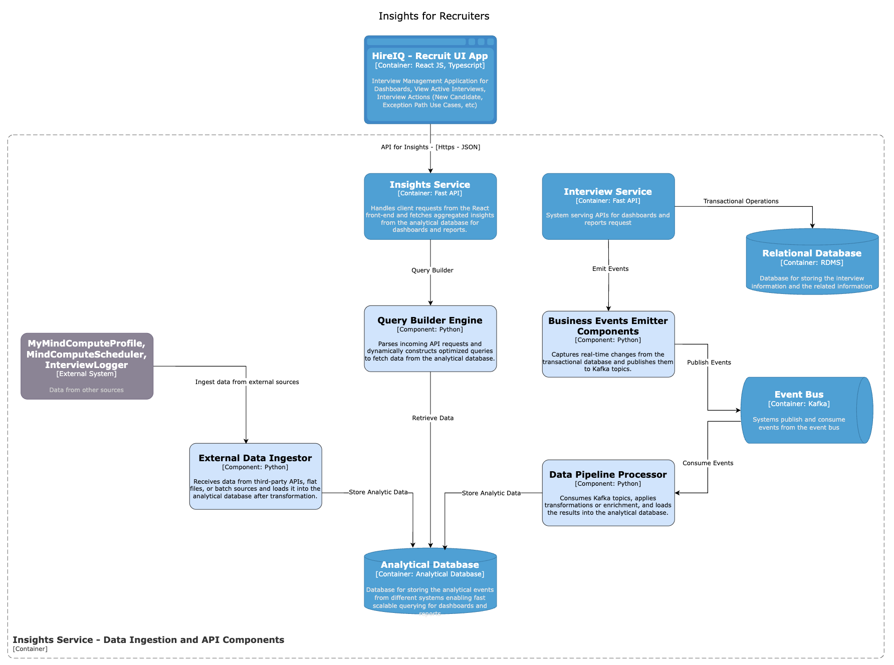

### 📘 C4 Diagram Legend

Legend attached below for interpreting elements like colors, shapes, arrows, and subsystems used in the diagrams.

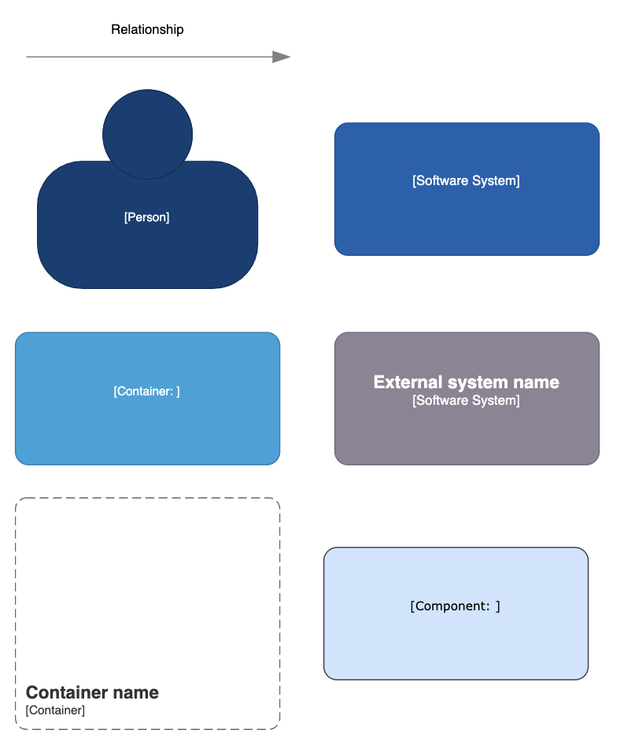

## 📝 Architecture Decision Records

* [ADR 1: Choosing the Database](adrs/0001-choosing-the-database.md)
* [ADR 2: Hybrid approach for match-making](adrs/0002-choosing-hybrid-approach-matchmaking.md)
* [ADR 3: Selection of Langflow for AI Agent Creation](adrs/0003-selection-of-langflow-for-ai-agent-creation.md)
* [ADR 4: Vector Database](adrs/0004-vector-database.md)
* [ADR 5: Architectural Characteristics](adrs/0005-architectural-characteristics.md)

## 🧑‍🔬 Testing & Evaluation Strategy

There are two types of systems to be tested i.e. business logic/algorithm based processes and AI based processes.

### Business logic & Algorithm Based Processes

Standard unit level and integration level tests will be used to validate all business logic and algorithm based processes.

### AI Based Processes

AI based processes will be tested using specific testing framework called DeepEval

### Overall Evaluation

Overall E2E performance of the AI components of the system can be evaluated using LLM as a Judge, where a separate LLM is used to judge the input and output of AI based system. In this technique a scorer LLM is used to determine if the output meets the expected criteria.

#### RAG Evaluation
For the "Matching Profile Retriever" component being RAG based it can be tested for the following metrics

- Precision: evaluates how well the ranking works based on the input and if re-ranking is needed.
- Recall: evaluates the embedding model on how accurate the retrieval is performed.
- Relevance: evaluates the text chunking and top K of the retrieved results.
 

#### Agent Evaluation
The agent "Interview Scheduling Assistant" testing is different from RAG testing as it involves evaluating the agent's performance in a conversation. We can use the following metrics for evaluation

- Tools called & Expected tools: evaluating the order in which the tools are called by the agent to complete the task.
- Completion Time: evaluating the time each agent takes to complete the task.
- Token Usage: evaluating the number of tokens used by the agent to complete the task.
- Turns: if using a reasoning approach how many turns the agent takes to complete the task. 

## 💻 Tech Stack

### 🛠️ Tech Stack

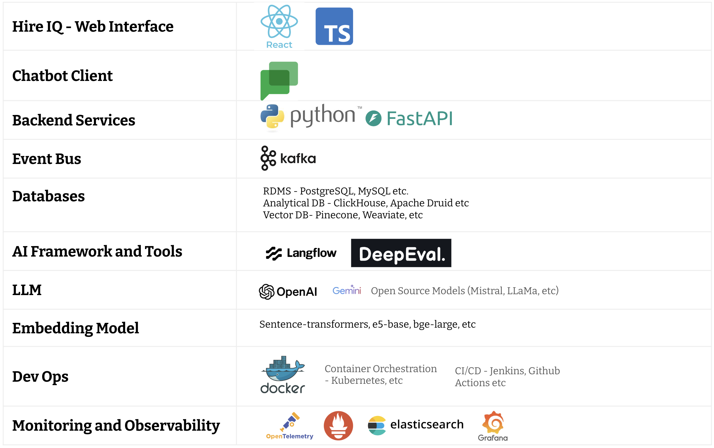

## 📦 Deployment

### 🚀 Deployment & CI/CD Pipeline Overview

This diagram illustrates the end-to-end CI/CD workflow from code commit to deployment across environments. 
All services are Dockerized, published to a container registry, and automatically deployed through a multi-stage pipeline 
into dev, staging, and production environments with quality gates.

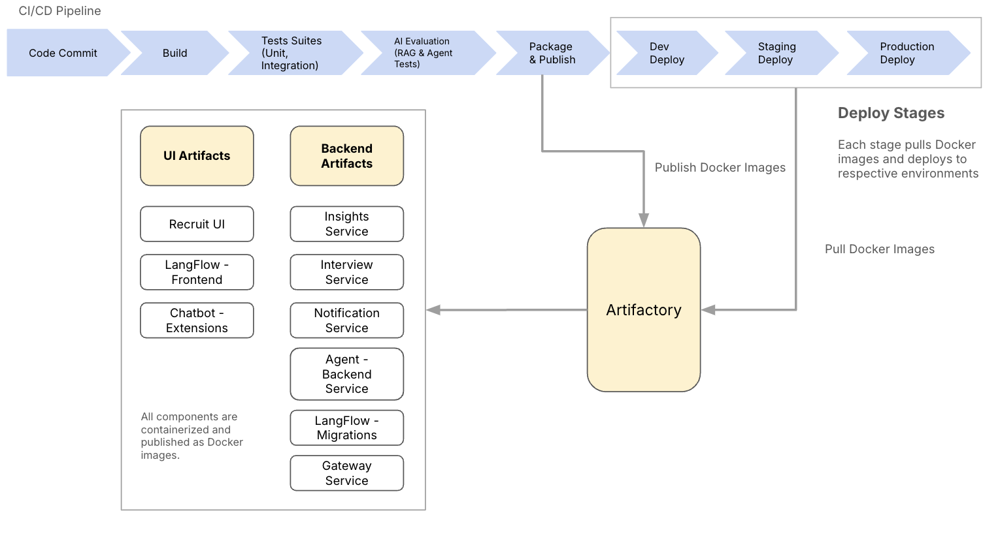

## 👥 Team Members

* **Balaji Sivakumar**
* **Pradeep Samuel Daniel**
* **Harini V S**
