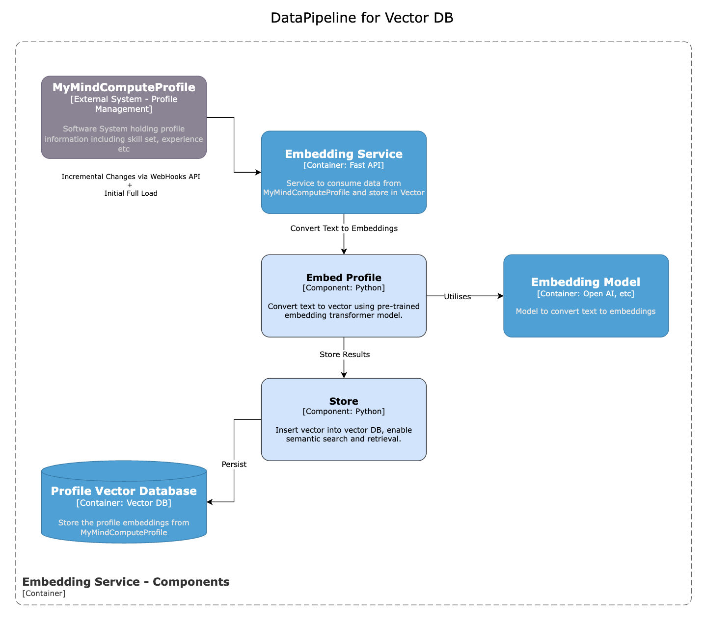

# 🧩 HireIQ C4 Component Diagrams – Summary

This document provides a breakdown of the key components across multiple sub-systems in the HireIQ Interview matching and 
scheduling system. It covers scheduling automation, LangFlow-based agents, vector DB pipelines, and insights processing.

---

## 1. 📅 Interview Scheduling Components 

- **Triggers from InterviewLogger** for new candidates or round progression initiate the scheduling workflow.
- **Filter Interviewers by Skill and Experience** using the `Vector Store Retriever` to retrieve semantically matched profiles from the `Profile Vector DB`.
- **Feed Retrieved Interviewers to the RAG Prompt Builder**, which builds a prompt combining vector results and query context for the LLM.
- **Filter Interviewers by Availability** via the `Availability Finder` using data from `MyMindLeave` and `MindComputeScheduler`.
- **Finalize Interviewer** through the `Match Maker`, considering availability, preferences, and capacity, assisted by the LLM.
- **Update Interview State** using the `State Updater` to record the finalized interviewer selection and interview status.

---

## 2. 🤖 LangFlow – Profile Search & Assistance Agent

- **Recruiter** initiates chat assistance queries via the `ChatBot` for profile searches or general assistance.
- **API Gateway** forwards these prompts to the `Profile Search and General Assistance Agent`.
- The agent performs **intent detection** using the `Router Component` to route:
    - Profile search queries to the RAG pipeline.
    - General queries to the `General Assistance` component.
    - Unrecognized queries to the `Fallback Component`.
- For profile search:
    - **Vector Store Retriever** fetches interviewer profiles from the `Profile Vector DB` based on semantic search.
    - Retrieved results are fed to the `RAG Prompt Builder` to construct a prompt using the vector context.
    - The constructed prompt is processed by the `Configurable LLM` to return suitable interviewer profiles.
- For general assistance:
    - The system uses the `Knowledge Vector Database` and the `General Assistance` component to respond to recruiter queries.
- The architecture ensures recruiters can get both **profile-based matches** and **general guidance** using a unified LangFlow agent.

---

## 3. 🔁 Embedding Service – Vector DB Pipeline

- MyMindComputeProfile sends profile data (incremental + full load).
- Embedding Service uses transformer models to convert text to vectors.
- Embeddings are stored in the vector DB to support downstream semantic search.
- Powers LangFlow agents for intelligent profile matching.

---

## 4. 📨 Interview Invite Handling (`c4-external-invites-handling.png`)

- Interview Service sends out calendar invites via Calendar Hub API.
- Webhooks notify the system on accept/reject actions.
- Events are processed to update the interview status in the DB and sync with InterviewLogger.
- Ensures round progression is tightly coupled with calendar status.

---

## 5. 📊 Insights for Recruiters (`c4-insights.png`)

- Ingests data from Interview Service, InterviewLogger, MindComputeScheduler, etc.
- Business Event Emitters and external ingestors populate the analytical DB.
- Insights Service exposes metrics, dashboards, and real-time interview views.
- Supports both dashboard queries and system KPIs using a query engine.

---

