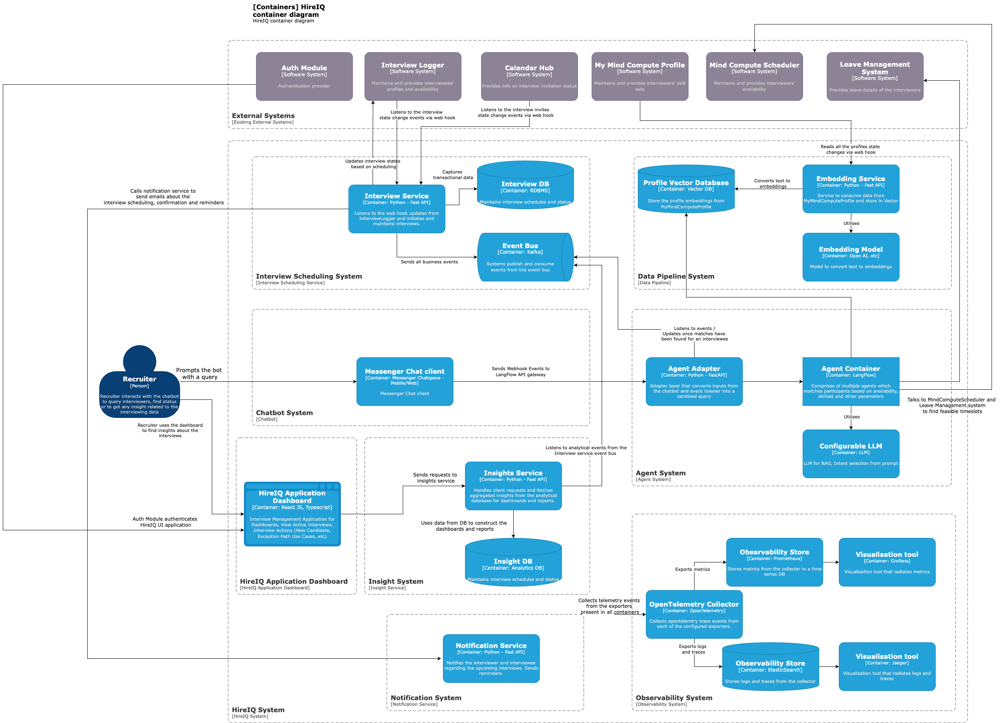

# 📦 HireIQ Container Architecture – Summary

This document summarizes the core container-level components of the HireIQ Interview matching and scheduling system, 
as depicted in the C4 container diagram.

---

## 👤 User Interaction

- **Recruiter** interacts with the system through:
    - **Messenger Bot** – to query and receive interview-related responses
    - **HireIQ Application Dashboard** – to view interview status and analytics

---

## 🌐 External Systems

- **Auth Module** – Authenticates users into the platform
- **InterviewLogger** – Supplies candidate data, interview round progression, and new candidate webhook triggers
- **Calendar System** – Handles event creation and webhooks for responses
- **MyMindComputeProfile** – Streams profile data changes for embedding
- **MindComputeScheduler / MyMindLeave** – Provides interviewer availability data

---

## 🧱 Core Systems & Containers

### 1. Interview Managing System
- **Interview Service** – Core business logic:
    - Listens for **webhooks from InterviewLogger** on:
        - New candidate added
        - Candidate advanced to next round
    - Triggers **automatic interviewer matching** via LangFlow
    - Calls Calendar System APIs to schedule interviews
- **Interview DB** – Stores interview lifecycle and participants information
- **Event Bus** – Publishes interview updates and propagates them to other services

### 2. Chatbot System
- **Messenger Client** – Bot interface for recruiters

### 3. Insight System
- **Insights Service** – Aggregates metrics and KPIs from interview data
- **Insight DB** – Stores historical insights
- **HireIQ Dashboard** – Presents insights and statuses to recruiters

### 4. LangFlow System
- **LangFlow Agent Container** – Hosts AI agents responsible for:
    - Matching interviewers to candidate profiles
    - Determining available slots
    - Scheduling interviews
- **API Gateway** – Handles internal LangFlow routing
- **LangFlow Event Bus** – Communicates match results, status changes
- **Configurable LLM Support** – LangFlow supports pluggable LLMs (OpenAI, Claude, Gemini), enabling flexibility and fallback options
- Integrates with **MyMindLeave / MindComputeScheduler** for real-time availability during scheduling

### 5. Data Pipeline System
- **Embedding Service** – Listens for profile updates from MyMindComputeProfile or Interview Service and generates vector embeddings
- **Profile Vector DB** – Stores embeddings for use in AI-based matching

### 6. Notification System
- **Notification Service** – Sends email/chat notifications on interview scheduling, reschedules, confirmations, and feedback loops

### 7. Observability System
- **OpenTelemetry Collector** – Collects logs, traces, and metrics from all containers
- **Observability Store** – Retains telemetry data
- **Visualization Tool** – Displays system dashboards, health, and alerts

---

## 🔄 Workflow Highlights

### 🔁 **Automatic Match & Schedule Flow (InterviewLogger → Interview System)**

1. **InterviewLogger Webhook** triggers when:
    - A new candidate is added
    - A candidate progresses to the next interview round

2. **Interview Service** receives the event, creates a draft interview, and:
    - Calls **LangFlow** to identify top matching interviewers based on profile vectors
    - Uses availability from **MyMindLeave / MindComputeScheduler**
    - Schedules the interview using **Calendar System APIs**

3. The result is:
    - Interview marked as "Scheduled" in the **Interview DB**
    - Stakeholders notified via the **Notification Service**
    - All relevant events published to the **Event Bus**
    - Matching logic powered by embeddings from the **Vector DB** and fallback logic via the **LLM (LangFlow Agent)**

4. The **HireIQ Dashboard** reflects the current status, while **Insights Service** updates interview pipeline analytics.

---
