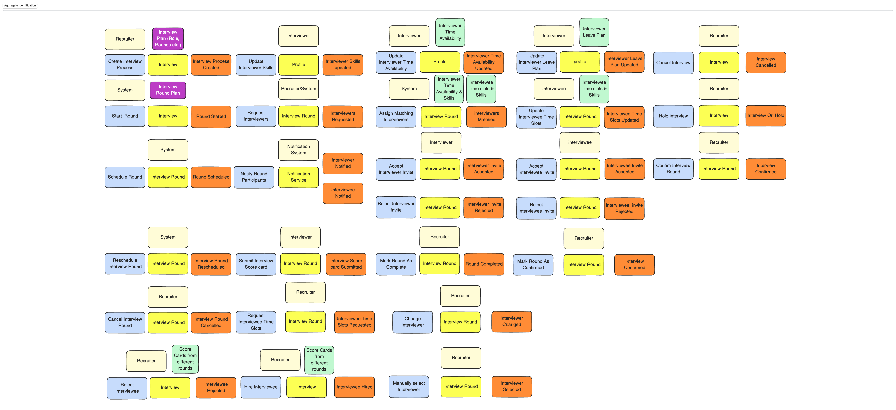
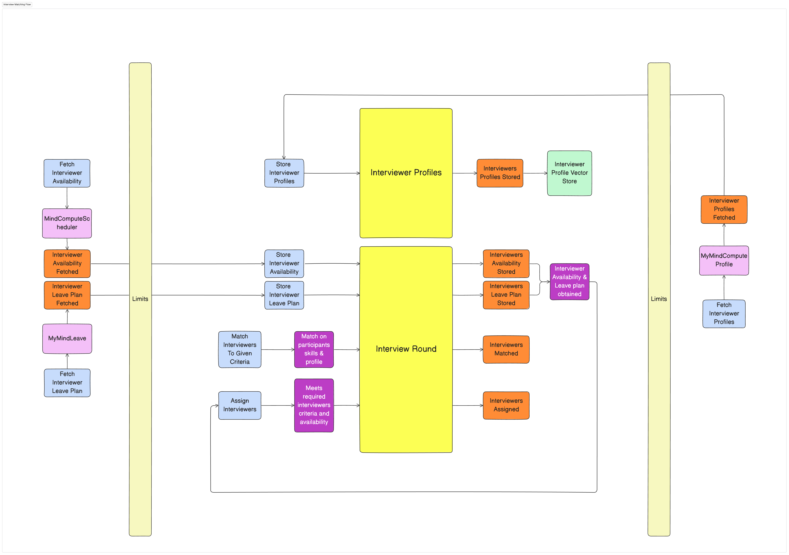
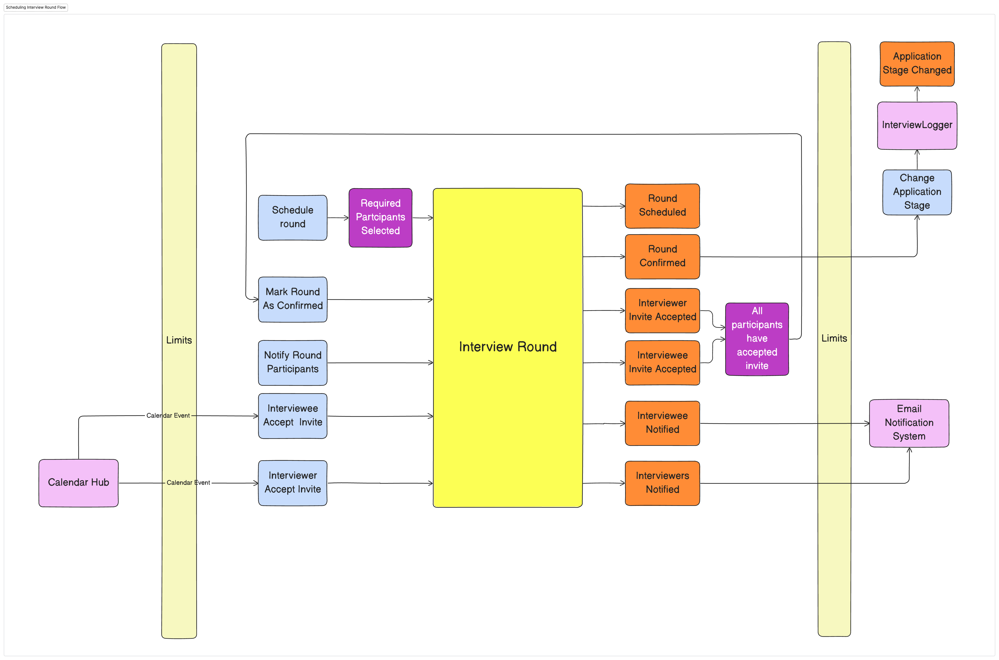

## Event Storming
### Event Storming Legend

Event Storming uses a standardized set of colored sticky notes to represent different elements of the business domain:

- **Orange (Domain Events)**: Something that happened in the system that domain experts care about
- **Blue (Commands)**: Actions that trigger domain events
- **Yellow (Actors)**: Users or systems that issue commands
- **Purple (Policies)**: Business rules that react to events and trigger new commands
- **Green (Read Models)**: Information used to make decisions
- **Red (Hotspots)**: Problems, questions, or areas of uncertainty
- **Pink (Aggregates)**: Clusters of related commands and events
### Event Identification

The first step in Event Storming is to identify all relevant domain events. Participants write down events on orange sticky notes and place them on the timeline.

**Process:**
1. Participants write down significant events in the business domain
2. Events are written in past tense (e.g., "Interview Scheduled")
3. Events are placed on a timeline from left to right
4. Clustering and discussion help identify missing events
5. This phase is deliberately chaotic to encourage free thinking
### Command, Event and Actor Identification

After identifying events, we determine what commands trigger these events and who issues these commands.

**Process:**
1. For each event, identify the command that caused it (blue sticky notes)
2. Commands are written in imperative form (e.g., "Schedule Interview")
3. Identify the actor who issues each command (yellow sticky notes)
4. Actors can be users, systems, or time-based triggers
5. Connect commands to the events they trigger
6. This helps identify cause-and-effect relationships in the business process
### Ubiquitous Language

A critical outcome of Event Storming is the development of a ubiquitous language - a common vocabulary shared by all team members and stakeholders.

**Key Aspects:**
1. Terms are clearly defined and agreed upon by both technical and business stakeholders
2. The language eliminates translation between business and technical terminology
3. Terms are consistently used in conversations, documentation, and code
4. The ubiquitous language evolves as understanding of the domain deepens
5. It forms the foundation for domain-driven design implementation
### Overall Flow

The overall flow represents the complete business process with all elements connected. This provides a comprehensive view of how the system operates.

**Elements Included:**
1. The chronological sequence of events
2. Commands that trigger each event
3. Actors who issue commands
4. Policies that react to events
5. Read models that inform decisions
6. Aggregates that group related commands and events
7. System boundaries (bounded contexts)

This visual representation serves as a shared reference for the entire team and guides implementation decisions.
### Business Flows Identified

After completing the Event Storming sessions, we identified several key business flows that represent the core processes of our interview management system. Each flow consists of commands (actions), events (outcomes), and policies (business rules) that govern the process.

The table below summarizes these flows with their associated commands, events, and policies. This structured representation helps translate the visual Event Storming results into actionable development guidance.

| Business Flow | Commands | Events | Policies |
| ----- | ----- | ----- | ----- |
| Starting interview  | <ul><li>Create Interview Process</li><li>Start Round</li></ul> | <ul><li>Interview Process Created</li><li>Round Started</li></ul> | <ul><li>Consult Interview Plan</li><li>Consult round plan</li></ul>

 |
| Interviewers Matching  | <ul><li>Store Interviewer Profiles</li><li>Store Interviewer Availability</li><li>Store Interviewer Leave Plan</li><li>Fetch Interviewer Availability</li><li>Fetch Interviewer Leave Plan</li><li>Fetch Interviewer Profiles</li><li>Match Interviewers To Criteria</li><li>Assign Interviewers</li></ul> | <ul><li>Interviewer Profiles Fetched</li><li>Interviewers Profiles Stored</li><li>Interviewers Availability Stored</li><li>Interviewers Leave Plan Stored</li><li>Interviewer Availability Fetched</li><li>Interviewer Leave Plan Fetched</li><li>Interviewers Matched</li><li>Interviewers Assigned</li></ul> | <ul><li>Match on participants skills & profile</li><li>Meets required interviewers criteria and availability</li></ul> |
| Scheduling Interview Round  | <ul><li>Schedule round</li><li>Notify Round Participants</li><li>Interviewee Accept  Invite</li><li>Interviewer Accept Invite</li><li>Mark Round As Confirmed</li></ul> | <ul><li>Round Scheduled</li><li>Interviewee Notified</li><li>Interviewers Notified</li><li>All Participants Accepted</li><li>Round Confirmed</li></ul> | <ul><li>Required Participants Selected</li><li>All participants have accepted invite</li></ul> |
| Reschedule Round  | <ul><li>Interviewer Reject Invite</li><li>Interviewee Reject Invite</li><li>Update Round Criteria</li></ul> | <ul><li>Interviewer Invite Rejected</li><li>Interviewee Invite Rejected</li><li>Round Criteria Updated</li></ul> | <ul><li>One or more participant have rejected invite</li></ul> |
| Interview Process  | <ul><li>Mark round in progress</li><li>Submit Score card</li><li>Mark round As Complete</li><li>Hire Interviewee</li><li>Don't hire Interviewee</li><li>Mark Interview As Complete</li><li>Mark Interview On Hold</li><li>Mark Interview Cancelled</li></ul> | <ul><li>Round In Progress</li><li>Score card submitted</li><li>Round Completed</li><li>Interview Completed</li><li>Interviewee Hired</li><li>Interviewee Not Hired</li><li>Interview On Hold</li><li>Interview Cancelled</li></ul> | <ul><li>No change in participants decision</li><li>All rounds completed</li><li>Provide reason for holding interview</li><li>Provide reason for cancellation</li></ul> |
| Round Not Confirmed  | <ul><li>Round Confirmation Timeout</li></ul> | <ul><li>Round Not confirmed On Time</li></ul> | <ul><li>Round Confirmation Policy Violated</li></ul> |
| Manually Assign Interviewers  | <ul><li>Manually select Interviewers</li></ul> | <ul><li>Interviewers Selected</li></ul> | <ul><li>Provide reason for manual selection</li></ul> |
### Detailed Flow Analysis

Below, we provide a detailed analysis of each business flow identified during our event storming sessions. These visual representations capture the sequence of commands, events, and policies that make up each flow.

#### 1. Starting Interview

The interview process begins with the creation of an interview process and the initiation of the first round.

**Key Components:**
- **Trigger**: Need to interview a candidate
- **Primary Commands**: Create Interview Process, Start Round
- **Key Events**: Interview Process Created, Round Started
- **Business Rules**: Must follow the established interview plan and round structure
- **Outcomes**: A structured interview process is initiated with defined rounds

**Process Description:**
1. HR or hiring manager initiates the interview process for a candidate
2. System creates a new interview process with a unique identifier
3. Initial round parameters are set according to the interview plan
4. First round is started, triggering subsequent flows

#### 2. Interviewer Matching

This flow handles the process of finding and assigning appropriate interviewers based on skills, availability, and other criteria.

**Key Components:**
- **Trigger**: Need to assign interviewers to a round
- **Primary Commands**: Fetch Interviewer Profiles, Match Interviewers To Criteria
- **Key Events**: Interviewers Matched, Interviewers Assigned
- **Business Rules**: Must match on skills and availability
- **Outcomes**: Appropriate interviewers are assigned to the interview round

**Process Description:**
1. System retrieves profiles of potential interviewers
2. Availability and leave plans are checked to ensure interviewer availability
3. Matching algorithm identifies interviewers with required skills and experience
4. Selected interviewers are assigned to the interview round
5. If automatic matching fails, system can fall back to manual assignment

#### 3. Interview Scheduling

Once interviewers are assigned, this flow manages the scheduling of the interview round and notification of all participants.

**Key Components:**
- **Trigger**: Interviewers assigned to a round
- **Primary Commands**: Schedule Round, Notify Participants
- **Key Events**: Round Scheduled, Participants Notified
- **Business Rules**: All required participants must be selected and available
- **Outcomes**: Interview round is scheduled and confirmed

**Process Description:**
1. System schedules the round based on availability of all participants
2. Notifications are sent to both interviewers and interviewee
3. System tracks acceptance/rejection of invitations
4. When all participants accept, round is marked as confirmed
5. Calendar invites are generated and distributed

#### 4. Interview Rescheduling

This flow handles situations where the initially scheduled interview needs to be rescheduled due to rejections or conflicts.

**Key Components:**
- **Trigger**: Rejection of interview invitation by any participant
- **Primary Commands**: Update Round Criteria, Manually Select Interviewers
- **Key Events**: Round Criteria Updated, Interviewers Selected
- **Business Rules**: Must provide reason for rejection and manual selection
- **Outcomes**: Interview is rescheduled with new parameters

**Process Description:**
1. System receives rejection notification from interviewer or interviewee
2. Round criteria are updated based on rejection reason
3. If automatic rematching fails, manual interviewer selection is initiated
4. New interviewers are assigned with justification for manual selection
5. Scheduling flow is reinitiated with new parameters

#### 5. Interview Process

This flow covers the execution of the interview round, collection of feedback, and decision-making process.

**Key Components:**
- **Trigger**: Confirmed interview round
- **Primary Commands**: Mark Round In Progress, Submit Score Card
- **Key Events**: Round In Progress, Score Card Submitted
- **Business Rules**: All rounds must be completed before final decision
- **Outcomes**: Interview process is completed with a hiring decision

**Process Description:**
1. Round is marked as in progress when it begins
2. Interviewers conduct the interview according to plan
3. Each interviewer submits a scorecard with evaluation and feedback
4. When all scorecards are submitted, round is marked as complete
5. If all rounds are complete, final hiring decision is made
6. Interview process is marked as complete, on hold, or cancelled based on outcome
